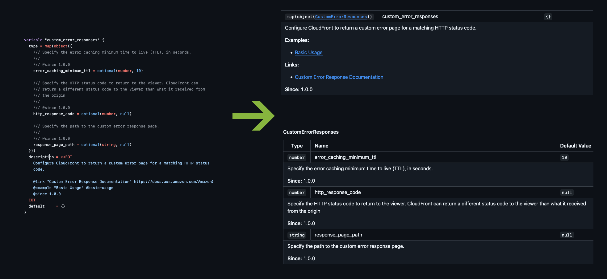

> [!WARNING]
>
> This library is currently in beta but stable; the API is subject to change before its first stable release. Please help us finalize the API by providing feedback in the [issues](https://github.com/FriendsOfTerraform/tfdocs-extras/issues) section or [our PR in the modules repository][fot-modules-pr].
 
# Terraform Documentation Extras (tfdocs-extras)

[](https://github.com/FriendsOfTerraform/tfdocs-extras/releases/latest) [](/LICENSE) [](https://github.com/FriendsOfTerraform/tfdocs-extras/actions/workflows/ci.yml)

A Go library for parsing an `object()` Terraform type definition string into a documented structure.  Support for [documenting nested objects has been a feature request dating back to April 2020](https://github.com/terraform-docs/terraform-docs/issues/242). The biggest challenge is that [Terraform Docs](https://github.com/terraform-docs/terraform-docs) does not parse the `object()` type definition itself and returns it as a raw string; this library fills that gap.

This repository houses a Go library that can parse a Terraform `object()` type definition string (including nested objects) into a structured representation that includes field names, types, optional status, default values, and parsed documentation (including support for doc directives like `@since`, `@example`, etc.). Additionally, it houses a simple CLI tool that uses this project's API for reading a Terraform variable file and outputting the parsed documentation in a GitHub-friendly Markdown format.

> [!TIP]
> See our [demo pull request using this tool][fot-modules-pr]



## Disclaimer

I am a frontend developer, and besides knowing what Terraform is, I have no experience using it. I built this library to solve a problem we have managing documentation in our [FriendsOfTerraform](https://github.com/FriendsOfTerraform) organization.

The goal is to eventually integrate this library into [Terraform Docs](https://github.com/terraform-docs/terraform-docs) either as a plugin or built-in functionality. I've only recently started learning Go, so I have no idea what the best approach for integrating this library into Terraform Docs is; feedback and direction are highly appreciated.

Like everybody else, I have multiple things in my life that require my attention, so if you'd like to encourage me to work on this, here's how you can do so:

- Provide feedback on this library (e.g. missing features, bug reports, etc.)
- Star this repository / follow me on GitHub
- [Sponsor me on GitHub](https://github.com/sponsors/allejo)

\- [@allejo](https://github.com/allejo)

## Usage as a Go Library

To integrate this library with your own tool, you can install it as a dependency via `go get`.

```bash
go get github.com/FriendsOfTerraform/tfdocs-extras
```

This library provides extra functionality on top of Terraform Docs. It exposes its main functions for parsing Terraform type definitions and generating documentation manifests.

### ParseModuleArgsIntoManifest

The primary function for processing both inputs and outputs from a Terraform module. It returns a `ModuleManifest` containing parsed and structured documentation for required inputs, optional inputs, outputs, and nested object structures.

```go
package main

import (
    "encoding/json"
    "fmt"

    "github.com/FriendsOfTerraform/tfdocs-extras"
    "github.com/terraform-docs/terraform-docs/print"
    "github.com/terraform-docs/terraform-docs/terraform"
)

func main() {
    // Use terraform-docs to load the module
    config := print.DefaultConfig()
    config.ModuleRoot = "/path/to/tf-module-folder"
    module, _ := terraform.LoadWithOptions(config)

    // Parse both inputs and outputs into a complete manifest
    manifest := tfdocextras.ParseModuleArgsIntoManifest(module.Inputs, module.Outputs)

    // The manifest contains:
    // - manifest.RequiredInputs: Required input variables
    // - manifest.OptionalInputs: Optional input variables
    // - manifest.Outputs: Module outputs
    // - manifest.NestedObjects: Nested object type definitions

    // Output the manifest as JSON for demonstration purposes
    astJSON, _ := json.MarshalIndent(manifest, "", "  ")
    fmt.Printf("%s\n", astJSON)
}
```

### ParseIntoDocumentedStruct

Parse a Terraform type definition string (such as `object({...})`, `map(object({...}))`, etc.) into a structured representation with documentation. This is useful when you need to parse type definitions directly without going through the full module loading process.

```go
package main

import (
    "encoding/json"
    "fmt"
    "strings"

    "github.com/FriendsOfTerraform/tfdocs-extras"
)

func main() {
    // Parse a type definition string
    typeDefinition := `map(object({
        /// The name of the configuration
        /// @since 1.0.0
        name = string
        
        /// The port number
        /// @since 1.0.0
        port = optional(number, 8080)
        
        /// Nested configuration settings
        settings = optional(object({
            /// Enable debug mode
            debug = bool
            
            /// Timeout in seconds
            timeout = number
        }))
    }))`

    // Parse the type definition
    documented, err := tfdocextras.ParseIntoDocumentedStruct(typeDefinition, "server_config")
    if err != nil {
        panic(err)
    }

    // Access the parsed structure
    fmt.Printf("Type: %s\n", documented.DataTypeStr)
    fmt.Printf("Nested Type: %s\n", *documented.NestedDataType)
    
    // Iterate through fields
    for _, field := range documented.Fields {
        fmt.Printf("\nField: %s\n", field.Name)
        fmt.Printf("  Type: %s\n", field.DataTypeStr)
        fmt.Printf("  Optional: %v\n", field.Optional)
        fmt.Printf("  Description: %s\n", strings.Join(field.Documentation.Content, " "))
        
        // Access directives
        for _, directive := range field.Documentation.Directives {
            fmt.Printf("  @%s: %s\n", directive.Name, directive.RawContent)
        }
    }

    // Convert to JSON
    jsonOutput, _ := json.MarshalIndent(documented, "", "  ")
    fmt.Printf("\nJSON Output:\n%s\n", jsonOutput)
}
```

## Usage as a CLI Tool

This project includes a rudimentary CLI tool that reads a Terraform module folder and outputs the parsed variable documentation in Markdown format.

[Download the latest build from GitHub](https://github.com/FriendsOfTerraform/tfdocs-extras/releases/latest)

> [!IMPORTANT]
> 
> This CLI tool is not intended to be a replacement for Terraform Docs and will become obsolete once its functionality is integrated into Terraform Docs either as a plugin or built-in feature.

The tool accepts a single argument specifying the path to a Terraform module folder. It will read the module folder using Terraform Docs, parse the variable definitions using this library, and write the output to a `README.md` file in the module folder.

```bash
./tfdocs-extra /path/to/TerraformModules/aws/route53
```

The README requires specific markers to identify where to insert the generated documentation. The generated markdown will be inserted between the following markers:

```
<!-- TFDOCS_EXTRAS_START -->

<!-- TFDOCS_EXTRAS_END -->
```

## Documentation Specification

> [!IMPORTANT]
> 
> This library is currently in beta, and this specification is subject to change before the first stable release.

The goal of this library is to support Terraform module creators to document their nested variables inline using comments instead of needing to maintain the documentation separately. We introduce two main features:

- Doc Blocks (denoted by `///` or `/** ... */`)
- Doc Directives (denoted by `@directive-name`)

Here's an example of how to document a nested object variable in Terraform:

```terraform
# variables.tf

variable "access_points" {
  type = map(object({
    /// Configures the permissions EFS use to create the specified root
    /// directory if the directory does not already exist
    ///
    /// @since 1.0.0
    root_directory_creation_permissions = optional(object({
      /// Owner group ID for the access point's root directory, if the directory
      /// does not already exist. Valid value: `0 - 4294967295`
      ///
      /// @since 1.0.0
      owner_group_id = number

      /// Owner user ID for the access point's root directory, if the directory
      /// does not already exist. Valid value: `0 - 4294967295`
      ///
      /// @since 1.0.0
      owner_user_id = number
    }))

    /// Path on the EFS file system to expose as the root directory to NFS 
    /// clients using the access point. A path can have up to four 
    /// subdirectories; `root_directory_creation_permissions` must be
    /// specified if the root path does not exist.
    ///
    /// @since 1.0.0
    root_directory_path = optional(string, "/")
  }))
  description = <<EOT
    Configures [access points][efs-access-point].

    @link {efs-access-point} https://docs.aws.amazon.com/efs/latest/ug/efs-access-points.html
    @example "Access Points" #access-points
    @since 1.0.0
  EOT
  default = {}
}
```

### Doc Blocks

Doc blocks are multi-line comments that start with `///` or are enclosed within `/** ... */`. The triple-slash style is supported to allow for a more compact syntax and to differentiate from regular comments (i.e. `//`).

```terraform
root_directory_creation_permissions = optional(object({
  /**
   * Owner group ID for the access point's root directory, if the directory
   * does not already exist. Valid value: `0 - 4294967295`
   *
   * @since 1.0.0
   */
  owner_group_id = number

  /// Owner user ID for the access point's root directory, if the directory
  /// does not already exist. Valid value: `0 - 4294967295`
  ///
  /// @since 1.0.0
  owner_user_id = number
}))
```

### Directives

Directives are special annotations within doc blocks that provide additional metadata about the documented field. They start with an `@` symbol followed by the directive name and content.

> [!TIP]
> Using HEREDOC syntax for a variable's `description` attribute allows you to use `@`-directives for a top-level variable.

#### `@enum`

When a field can accept only a specific set of values, you can document the allowed values using the `@enum` directive. The different values are delimited by a vertical pipe (i.e. `|`); spaces around the pipe are optional.

```
@enum value1|value2|value3
```

#### `@example`

The `@example` directive allows you to provide usage examples for the documented field. They will be listed alongside the field's documentation under the "Examples" section. It accepts two parameters: a title and a link (URL or anchor).

```
@example "Advanced Usage Example" #heading-id
@example "Basic Usage Example" https://example.com/usage-example
```

#### `@link`

There are two types of links you can create using the `@link` directive: named links and reference links.

##### Named Links

A name link allows you to create a link with a custom display name and will be displayed alongside the field's documentation in a special "Links" section.

```
@link "Some Resource Documentation" https://example.com/some/resource
```

##### Reference Links

A reference link uses curly braces (i.e. `{}`) to create [link reference definitions](https://spec.commonmark.org/0.31.2/#link-reference-definition). If you create your link reference definition manually in your markdown file, you can omit the `@link` directive altogether. However, if you want to generate the link reference definitions to support [reference links](https://spec.commonmark.org/0.31.2/#full-reference-link), you can use the `@link` directive with curly braces.

```
A link to [Some Resource Documentation][resource-id].

@link {resource-id} https://example.com/some/resource
```

> [!TIP]
> Reference links are useful when you want to reuse the same link multiple times in your documentation without repeating the URL. Another use case is when the URL is long and would clutter the documentation if displayed inline.

#### `@regex`

The `@regex` directive allows you to specify a regular expression between `/` delimiters that the field's value must match. After the pattern, you can provide example values that conform to the regex.

```
@regex /(Average|Minimum|Maximum) (<=|<|>=|>) (\d+)/ "Average >= 20" "Minimum < 10" "Maximum <= 100"
```

#### `@since`

The version when the field was introduced.

```
@since 1.0.0
```

#### `@type`

The `@type` directive allows you to specify an output's data type where the type information is not automatically available. This directive supports multiline type definitions for complex nested structures.

```terraform
output "nat_gateways" {
  description = <<EOT
    Map of default NAT gateways. The key of the map is the NAT gateway's name
    
    @since 1.0.0
    @type map(object({
      /// The availability zone of the NAT gateway
      /// @since 1.0.0
      availability_zone = string
      
      /// The association ID of the Elastic IP address that's associated with the NAT Gateway
      /// @since 1.0.0
      association_id = string
    }))
  EOT
  value = aws_nat_gateway.this
}
```

> [!NOTE]
> The `@type` directive supports multiline definitions. When the directive contains an opening bracket (`(` or `{`), the parser will automatically continue reading subsequent lines until all brackets are balanced.

## License

[MIT](./LICENSE)

[fot-modules-pr]: https://github.com/FriendsOfTerraform/modules/pull/55